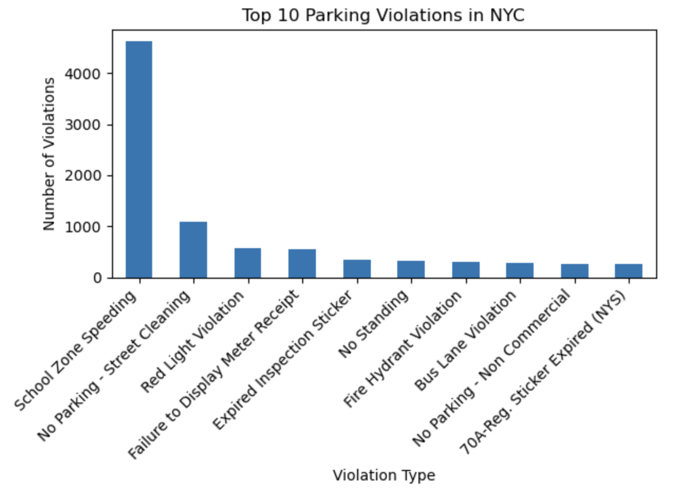
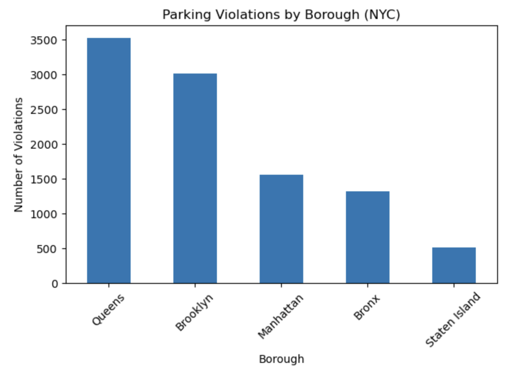
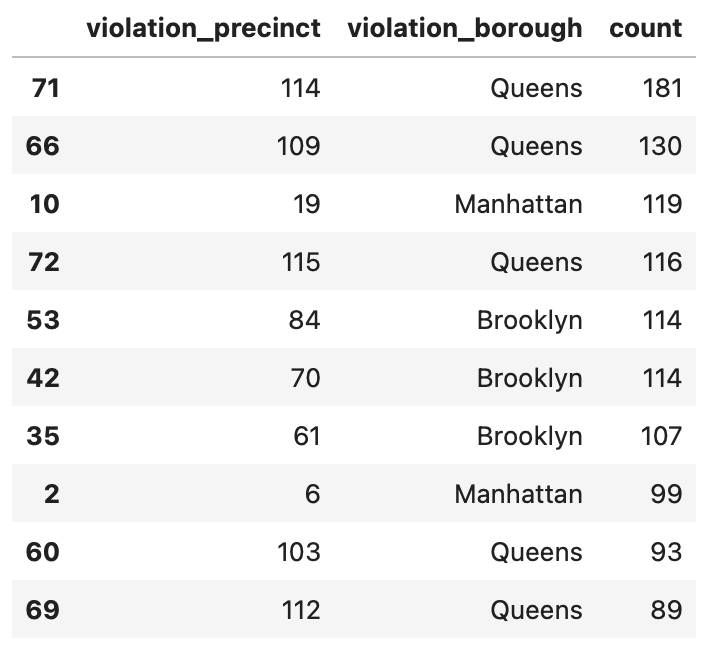

# NYC Parking Violations Analysis

Exploratory data analysis of NYC parking and camera-issued violations, built from a live pull of the NYC Open Data Socrata API. The project cleans a messy, real-world municipal dataset and surfaces which violation types, boroughs, and precincts drive enforcement activity across the city.

**Team:** Federico Ciandri, Sabrina Zhu, Yongheng Guan
**Course:** CIS 9650 — Programming for Analytics, Baruch College (Spring 2026)

## Overview

Using the [NYC Open Parking and Camera Violations](https://data.cityofnewyork.us/City-Government/Open-Parking-and-Camera-Violations/nc67-uf89) dataset, we pulled 10,000 records via paginated API requests, cleaned and standardized inconsistent categorical fields, and analyzed violation patterns by type, borough, precinct, and vehicle make.

## Data

- **Source:** NYC Open Data Socrata API (`8zf9-spf8`), retrieved with `requests` in 200-row pages up to a 10,000-row sample
- **Raw shape:** 10,000 rows × 40 columns
- **After cleaning:** 10,000 rows × 30 columns (dropped 10 columns that were more than ~56% missing, e.g. `meter_number`, `days_parking_in_effect`, `unregistered_vehicle`)
- Full dataset included in [`data/parking_violations_dataset.csv`](data/parking_violations_dataset.csv)

## Data cleaning highlights

- **Violation descriptions:** consolidated inconsistent/duplicate labels (e.g. `"21-No Parking (street clean)"` and `"No Parking Street Cleaning"` → one category, `No Parking - Street Cleaning`) into a single readable `violations_description` field.
- **Vehicle makes:** expanded abbreviated codes (`TOYOT` → `TOYOTA`, `ME/BE` → `MERCEDES-BENZ`, etc.) for clearer reporting.
- **Boroughs:** normalized inconsistent county abbreviations (`QN`, `Q`, `Qns` → `Queens`; `BK`, `K`, `Kings` → `Brooklyn`; etc.) into the five standard NYC boroughs.
- **Dates:** parsed `issue_date` to datetime and flagged that the sample's date coverage (Jan 2023–Jun 2025) is unevenly distributed, so month-over-month trends are not treated as true seasonality.

## Key findings

- **Most common violation:** School Zone Speeding (camera-issued) — 4,617 tickets, far ahead of every other category, followed by No Parking - Street Cleaning (1,087) and Red Light Violations (566).
- **Top hotspot street** (WB N Conduit Ave) is a speed-camera location near a school — not a traditional parking-enforcement corridor — meaning the top "hotspot" in the raw data reflects automated camera enforcement rather than officer patrol patterns.
- **Borough distribution:** Queens (3,528) and Brooklyn (3,014) together account for ~65% of all violations in the sample; Staten Island has the fewest (513).
- **Precinct concentration:** a small number of precincts — mostly in Queens and Brooklyn — issue a disproportionate share of tickets, suggesting enforcement or violation activity clusters around specific residential/commercial corridors rather than spreading evenly citywide.
- **Vehicle makes:** Honda, Toyota, and Nissan top the violation list, but this closely tracks their share of NYC's general vehicle population — i.e., no evidence of brand-specific enforcement bias.

## Recommendations

Because most violations involve dangerous driving behavior (school-zone speeding, red-light running) rather than routine parking infractions, the analysis suggests prioritizing traffic-safety infrastructure (e.g., speed bumps near the Conduit Ave school zone) and directing enforcement resources toward the highest-violation precincts in Queens and Brooklyn.

## Repository contents

| Path | Description |
|---|---|
| [`notebook/parking_violations_analysis.ipynb`](notebook/parking_violations_analysis.ipynb) | Full analysis: API retrieval, cleaning, and EDA (Python / pandas / matplotlib) |
| [`data/parking_violations_dataset.csv`](data/parking_violations_dataset.csv) | Raw 10,000-row extract used in the analysis |
| [`images/`](images) | Exported charts and tables referenced below |
| [`docs/Parking_Violations_Summary.docx`](docs/Parking_Violations_Summary.docx) | One-page written summary of findings and recommendations |
| [`docs/Project_Presentation.pptx`](docs/Project_Presentation.pptx) | Slide deck presenting the project |

## Charts

**Top 10 violation types**

**Violations by borough**

**Top violation-issuing precincts by borough**

## Tools

Python, pandas, matplotlib, the `requests` library, NYC Open Data Socrata API
